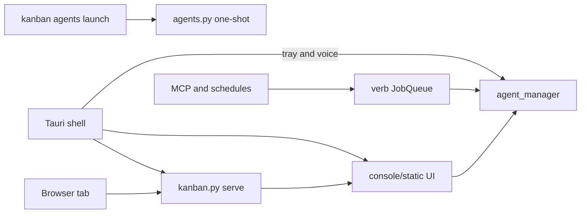

# Control panel: what it is, what is wrong, what to do next

Do not start a new codebase. The product direction is already locked in [T-016](knowledge-center/artifacts/T-016/T-016-summary.md): the desktop shell opens on the Assistant, other tabs stay as the record, and every piece of watched work is a Run. That lock is built and sitting in Verify. A rewrite would re-learn the same problems and discard the plugin server, the verb registry, and the test suite (T-020’s last full run was 1867 passed).

`python console/kanban.py reset` already wipes tickets and logs back to an empty template ([reset-to-clean-slate](knowledge-center/wiki/reset-to-clean-slate.md)). That is a data clean slate. The code does not need one.

## What the two apps actually are

- **Web:** [console/](console/) — stdlib Python (`kanban.py` → [httpd.py](console/server/httpd.py)) plus a no-build vanilla JS UI in [console/static/](console/static/). Features turn on from [plugins.toml](console/config/plugins.toml). Ticket state is TOML under `knowledge-center/artifacts/`, mutated only through the CLI/verbs.
- **Desktop:** [desktop/](desktop/) — Tauri 2 window that loads that same UI (`WebviewUrl` pointed at `kanban.py serve`). Rust adds tray, local speech, screen/clipboard/OCR, and a loopback bridge. It does not have its own product screens. `desktop/src-tauri/placeholder/index.html` is only a “Starting…” stub.

Rough size: about 88 server modules (~17.5k lines), ~21 JS files (~11k lines, largest [settings.js](console/static/settings.js), [agents.js](console/static/agents.js), [styles.css](console/static/styles.css)), ~104 Python test modules, a Rust host. Standards that are already right: no frontend build, plugins so a disabled feature removes its routes, verbs so CLI / queue / MCP share one rule set, approvals fail closed.

## How an agent actually gets called

There are four doors. Three of them should feel like one product. The fourth is a weaker CLI.

1. **Agents tab (inspector).** [agents.js](console/static/agents.js) → `POST /api/agents/chats` → [agent_manager.create](console/server/agent_manager.py). Backend row comes from [agents.toml](console/config/agents.toml). `stream_json` (Claude) can be steered mid-turn. `resume` (Cursor, Codex) and `openai_api` (OpenRouter, Ollama, LM Studio) queue the next turn. Ticketed chats get a git worktree. Gated tools raise a Permission-needed card (CLI via a PreToolUse hook, API in-process).
2. **Assistant (home, tray, voice).** Tray and mic call `POST /api/assistant/say`, which reuses the same `agent_manager` session. The HUD Allow/Deny hits the same approval registry.
3. **Runs, verbs, MCP.** A Run in [runs.py](console/server/runs.py) points at a chat or a job. The watchdog in [run_watchdog.py](console/server/run_watchdog.py) classifies stalls and retries. Schedules and MCP call verbs in [verbs.toml](console/config/verbs.toml); `delegate` starts another chat through `agent_manager`. The seven harness roles (analyst, planner, builder, …) still do their work in Cursor or Claude Code. The console launches and watches them. It does not contain the pipeline.
4. **One-shot CLI.** `kanban agents launch` in [agents.py](console/server/agents.py) uses the same backend registry but skips steering, worktrees, and the approval hook. A restart loses track of an in-flight job. This is the path the About tab still describes as if it were the Agents tab.

Names that trip people: `console/server/backends/` is the vault, not the agent registry. `jobs.py` is the verb queue. `agents.py` “jobs” are one-shot processes. `runs.py` is the durable work record.

## What is already in good shape

- Plugin split and “reads in the UI, writes through verbs” are coherent. Migrations and Releases boards, and Projects and Files tabs, are absent on purpose.
- Live chat, approvals, worktrees, spend telemetry, and the T-020 run watchdog are real and tested on the server.
- Desktop honestly refuses screen and clipboard tools when the shell is not running.

## Confirmed drift (lies and split brains)

These are in the current tree, not leftover ticket notes:

- [about.js](console/static/about.js) still says the Agents tab is a headless one-shot with “No live steering,” in the same section that describes the live approval card. The live tab is [agents.js](console/static/agents.js) lines 1–14. The one-shot limits belong only to `agents launch`.
- [console/README.md](console/README.md) still says screen, voice, and OS control “belong in a planned native shell.” That shell is [desktop/](desktop/) and is what you run.
- [agents.js](console/static/agents.js) lines 16–17 say every chat runs at the workspace root. Ticketed chats use a worktree (`agent_manager`, since T-018).
- Two chat UIs: Agents uses `ConsoleChatStore` / `ConsoleChatRender`. The Assistant keeps its own log and `EventSource` in `assistant.js`.
- Two “home” orders: browser Overview first; desktop Assistant first ([app.js](console/static/app.js) when `html.in-shell`). Correct per T-016, easy to miss because About and the console README still teach the old kanban-first story.
- Tray rows in [features.toml](desktop/features.toml) with `available = false` are unfinished on purpose: open last chat, dictate-without-send, mic mute, saved prompts, watch mode, mouse/keyboard actuation. Actuation is marked dangerous and must stay behind the in-chat permission card.
- Live sessions live in process memory. Restart keeps the transcript for replay; it does not resume the process unless that backend can resume. `serve.log` from the sidecar is unbounded (accepted in the desktop README). There is no installer (dmg / NSIS); launch is `cargo run` plus a Start-menu shortcut script.
- Frontend JS has no unit tests. Server agent, verb, run, and HTTP-contract tests are strong. Tab aggregation (`overview`, `worklog`, `analytics`, `vault`) is thinner.

No open bug rows turned up in the ticket trackers. The open work is unfinished tickets, not a bug list.

## Product gaps (not bugs)

- **Verify is where finished work is stuck.** T-015 (Assistant speed, honest tray, dismissible popup), T-016 (Assistant as home), and T-019 (hands-free) are in Verify. T-020 (reliable Runs) is built and verified locally, held because Windows CI, a real Claude quota check, and two human gates in `agents.toml` were not exercised. T-021 (evidence and liveness lint) is frozen and unbuilt, and it waits on T-020 for part of its scope. T-022 (golden-prompt evals) has a replay runner; live smoke has not been run.
- **The harness is not inside the console.** Launching analyst/planner/builder from a Run still depends on Cursor or Claude. That is an explicit decision, not a missing feature.
- **Safety is uneven.** Live chats gate tools. `agents launch` does not. Two untracked chats can edit the same tree.

## What “cleaner” means

Keep the server, the verb registry, the desktop shell, and the vault. Change the story and the duplicate doors so a new engineer hits one picture:

- **Home:** Assistant, in the desktop shell.
- **Work:** a Run you can watch (stall, retry, claim).
- **Record:** boards, vault, work log, analytics — drawers, not a second product.
- **Inspector:** the Agents tab, showing those Runs. Not a second way to think about launching.
- **Debug CLI:** `agents launch`, labeled as the path without steer, worktree, or approval.

Do not split `settings.js` / `agents.js` / `styles.css` for neatness alone. Split only when a change is already touching that file. Do not add Projects, Files, Migrations, or Releases. Do not move the seven-agent pipeline into the console.

## Recommended sequence

1. **Truth pass (small, do this first).** Rewrite the Agents section in [about.js](console/static/about.js) so it describes live chat, and move the three one-shot limits to a sentence about `agents launch`. Update the “planned native shell” paragraph in [console/README.md](console/README.md) to point at [desktop/README.md](desktop/README.md). Fix the workspace-root comment in [agents.js](console/static/agents.js). Add a short “four doors, one manager” section to the console README architecture area so the next reader does not reconstruct this audit.
2. **Close or park the Verify pile before new features.** Walk T-015, T-016, and T-019 against the running shell (Assistant opens first, tray matches `features.toml`, overlay dismisses, hands-free spots on audio). For T-020, either run the held checks or record them as accepted limits and close. Then T-021 can build the liveness and evidence lints on a closed Run model. T-022 live smoke stays ASK-gated (it calls a real model).
3. **One chat surface.** Point the Assistant transcript at `ConsoleChatStore` / `ConsoleChatRender` so approvals, steer/queue, and SSE reconnect are not implemented twice. Leave `agent_manager` as the only interactive launcher. Keep `agents launch` as the explicit lesser CLI.
4. **Only after that, product polish.** Durable resume across server restart, a rotating sidecar log, and the tray rows you actually want (dictate-without-send is the useful one; actuation stays gated). Frontend tests only around the chat store and the shell’s Assistant-first sort — the two places a regression would lie to you.

A full rewrite is the wrong clean slate. The right one is: one home, one work object, one launcher, and docs that match the code.