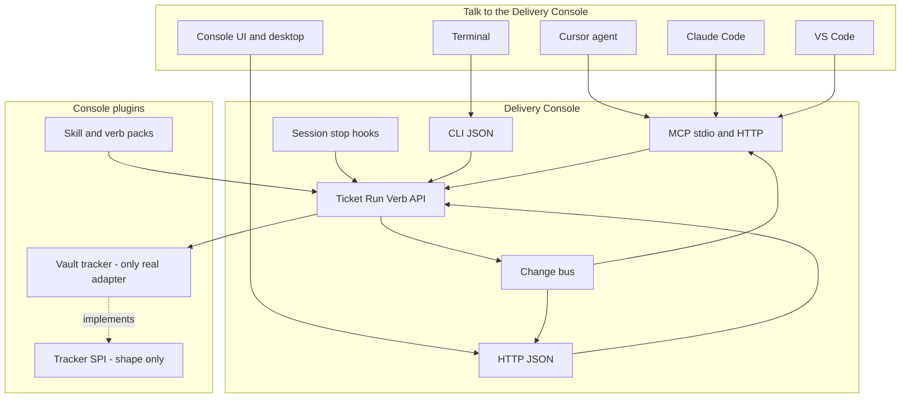

# Improve the Delivery Console

This plan is to **improve the Delivery Console** — the product already in [`console/`](console/). It is not a new product and not a repo-split project that happens to mention the console.

The console already has boards, an Assistant, verbs, MCP, a CLI, a desktop shell, a plugin flag file, and — as of T-016 (Verify stage) — a real unified Run object ([`console/server/runs.py`](console/server/runs.py), a tagged union pointing at chat/job/cursor). Those pieces do not yet behave as one product: editors drift, the CLI has a dual kickoff path, MCP has no resources/notifications, and the console cannot run unless `knowledge-center/` sits beside it.

**What "improved" means:**

- You drive the console from the **CLI**, the **UI**, or **MCP**. A ticket change in any of them shows up in the others.
- The console **plugs into editors**. The tracker layer has a real **plugin shape**, even though only the vault implements it for now.
- Knowledge can live in **another repo**. Updating the console does not rewrite someone else's work.
- Agents **pull ready work**, **claim** it, **comment**, and **link a branch/PR**. Humans review.

Keep [T-016](knowledge-center/artifacts/T-016/T-016-summary.md)'s Assistant-as-home and Run object — that work is done, not something to rebuild here. Keep [T-015](knowledge-center/artifacts/T-015/T-015-summary.md)'s Assistant/voice scope where it is; a voice-adapter pass is not part of this plan. Do not fold either ticket in. Do not greenfield-rewrite the Python app.

---

## Scope split

This used to be a single 10-item plan. It is now two tickets plus an explicit out-of-scope list, because the items span very different size and risk:

- **Console core (proposed T-017)** — `one-api`, `mcp-first-class`, `tracker-spi`, `workspace-contract`, `ready-claim-hooks`. Independently plannable and verifiable; no dependency on git/worktree machinery.
- **Ticket-git-Run (proposed T-018, depends on T-017)** — `ticket-git-run`: worktree-per-Run, branch/PR linkage, lane hints, Run inspector diff. Needs T-017's Run and ready/claim verbs to exist first.
- **Out of scope for both** (future tickets, only if/when actually needed): real Jira/Azure/Linear/GitHub Issues tracker adapters (T-017 ships the SPI, not the adapters); the 39→12 skill harness-kernel collapse (a separate, high-risk change to the skill system, decided on its own merits later); a voice adapter pass (barge-in/VAD/doctor — overlaps T-015's still-open Assistant/voice scope, not this initiative); an optional vault git-split (not scheduled — do only if explicitly asked later).

---

## What is wrong with the console today

**1. CLI, MCP, and UI are not one console**

[`.mcp.json`](.mcp.json) and [`console/mcp_server.py`](console/mcp_server.py) already expose verbs. [`console/server/mcp.py`](console/server/mcp.py) is tools-only, stdio-only — confirmed: it implements only `initialize`, `notifications/initialized`, `ping`, `tools/list`, `tools/call`; no `resources` capability, no change notifications. Skills paste `python console/kanban.py …`. MCP finds the workspace by requiring sibling `knowledge-center/` and `console/` in [`console/server/paths.py`](console/server/paths.py) (`_is_repo_root` / `find_repo_root`).

**2. Plugins cannot extend the console**

[`plugins.toml`](console/config/plugins.toml) is in-tree feature flags, loaded by [`console/server/plugins/registry.py`](console/server/plugins/registry.py). The vault store path is a hardcoded constant (`VAULT_SUBDIR = "knowledge-center"` in [`console/server/vault.py`](console/server/vault.py)), not a plugin.

**3. The CLI is not agent-friendly**

[`console/kanban.py`](console/kanban.py) is ~950 lines. **Confirmed dual kickoff**: `cmd_ticket_create` in kanban.py calls `tickets.create()` directly (bare `ticket.toml` only), while the real `kickoff` verb goes through [`console/server/kickoff.py`](console/server/kickoff.py)'s `create_ticket` (id generation, template rendering, artifact-map row). Two independent ticket-creation paths exist and should be one. **No `ready`/`claim` verb or command exists** (confirmed absent from both `kanban.py` and `console/config/verbs.toml`). JSON output already exists on most commands (16+ already support or default to `--json`), but it is not a *uniform, guaranteed* contract across every subcommand — that gap is what `one-api` closes, not "add JSON from scratch."

**4. Runs do not own git isolation**

Worktree commands exist ([`console/server/worktrees.py`](console/server/worktrees.py): add/remove/prune/list) but `launch_role` and live chats still run in the shared tree — [`console/server/agent_manager.py`](console/server/agent_manager.py) states outright that `sess.cwd` IS the workspace root. No ticket-id-in-branch convention, no PR link on the card, no in-console diff to send back to the agent.

---

## Ideas from the field (research, 2026)

Steal only what makes **this** console better. Do not become the source product.

**Agent-native boards** ([mcp-kanban](https://github.com/gablabelle/mcp-kanban), [agent-kanban](https://github.com/graywrk/agent-kanban), [agent-tasks](https://github.com/keshrath/agent-tasks/))

- The board is **passive**. Agents stay in Cursor/Claude. The console does not have to spawn them to be useful.
- **Pull, don't only push:** `get_next` / `ready` + `claim` with an agent id so two runs cannot steal the same ticket.
- **Comments and progress events** on the card (human and agent share one thread).
- **Stop hook:** if the agent exits without moving the ticket, remind it. mcp-kanban does this; our session hooks currently only refresh the index.
- **Stage gates** (named artifacts before a lane advance) are our GROUND→VERIFY pipeline — expose them as console rules, not a second workflow engine.
- **Real-time UI** over SSE/WebSocket, not a manual refresh.

**Issue trackers with MCP** ([beads](https://github.com/steveyegge/beads), [Plane MCP](https://developers.plane.so/dev-tools/mcp-server), [Lific compare](https://lific.dev/compare))

- **Few tools.** Beads warns MCP schemas cost 10–50k tokens vs 1–2k for CLI+hooks. Plane collapsed ~177 operations into **28 resource tools** with an `action` parameter. The console must stay on a **small verb list** plus one `context` digest (already exists as a verb — see `console/config/verbs.toml`). Never dump a remote tracker's full API as 100 MCP tools — this is exactly why real Jira/Azure/Linear/GitHub adapters are cut from this plan; only the SPI shape ships here.
- **`ready`** = unblocked work in one call. **`discovered-from`** when an agent finds extra work mid-ticket.
- **`console setup cursor|claude|vscode`** (beads `bd setup …`) writes MCP config and a short AGENTS.md snippet so the agent finds the workflow.
- Vault remains canonical for `{T}-plan.md`. A future real tracker adapter would sync keys, status, comments — not replace the vault.

**Parallel agent UX** ([Vibe Kanban](https://github.com/bloopai/vibe-kanban/), [Conductor](https://www.conductor.build/docs/concepts/workflow))

- **Issue → isolated worktree/branch → review → PR.** Conductor: workspace is the unit of delegation; branch/PR is the unit of integration.
- **Lane follows git:** agent start → in-progress; PR open → verify; merge → done (Vibe). Ticket id in branch name.
- **Diff in the Run inspector**, inline comments batched back to the agent (Vibe). v1 can show `git diff --stat` + path; full GitHub-like review can wait.
- Open the worktree in the IDE. Switch backends (Claude, Cursor, Codex) without leaving the console — we already have `agents.toml`.
- **Do not** make the console the only place agents run (OpenHands/Vibe default). Keep T-016's hybrid: console launches a named Run; Cursor/Claude do the work.

**Observability** (Lookspan, cot, AgentOps)

- A Run should be a **trace**: model, tools, tokens, cost, approvals. The console already has telemetry; surface it on the Run (which now exists per T-016), not a separate product.

**Don't copy**

- Plane's 139-tool dump; Vikunja's 50–180 community tools.
- Replacing vault markdown with beads' in-repo Dolt graph.
- Docker-required sandboxes as the default (OpenHands).
- A marketplace in v1.
- Building the tracker SPI as a pretext to immediately ship Jira/Azure — ship the shape, not the adapters, until one is actually needed.

---

## How the improved console works (T-017 scope)



Finish the one-API rule:

- **No other write path.** Skills call CLI or MCP.
- **Live sync.** Writes emit events. UI EventSource. MCP resources update. Streamable **HTTP MCP on the already-running `serve`** so Cursor and Claude Code share one process (stdio remains for offline).
- **Small MCP.** Verbs stay few. Prefer `context`, `ready`, `claim`, `ticket-move`, `tracker-add`, `run-show`. Fat lists belong in `--json` CLI or `context`, not in the tool schema.
- **CLI for agents.** `console ticket ready --json`, `console ticket claim T-018 --agent cursor`. Same as MCP.
- **`console setup <editor>`** writes MCP config into listed projects plus a short AGENTS.md block: use these tools, never edit `ticket.toml`.
- **Stop hook** reminds the agent to claim/move/comment before the session ends.

Coding agents stay in the editor. The console does not absorb the builder loop.

---

## Tracker SPI (T-017) — shape only

- **Tracker** interface — list / show / create / move / set / comment / ready / claim. **Default and only real adapter: vault.**
- No Jira, Azure Boards, Linear, or GitHub Issues code ships in T-017. The interface exists so a real adapter can be added later without touching core, but building one is a separate future ticket, scoped only when there's an actual integration need.
- **Locked:** vault is canonical for delivery artifacts. A future tracker adapter would sync identity, status, and comments — vault lane still wins for the pipeline.

---

## Bind the console to a vault (T-017 packaging)

```toml
# workspace.toml
name = "noble"
vault = "../noble-knowledge"
console = "."
projects = ["../app", "../api"]
```

Skill load order: vault `skills/` → project `.claude/skills/` → user packs → bundled. This does not touch the skill *count* — the 39→12 harness-kernel collapse is explicitly out of scope for this plan (see below).

`console setup <editor>` covers the init-wizard/AGENTS.md-snippet need from the old `setup-packs-vault` idea; there is no separate wizard step. An optional vault git-split stays possible but is not scheduled — do it only if explicitly asked.

---

## Ticket, git, and Run (T-018, depends on T-017)

Using machinery that already almost exists (worktree commands, T-016's Run object):

- Ticket id in branch name and PR title; store `branch` / `pr_url` on the ticket or Run.
- **Default worktree per Run** (today `launch_role` and live chats share the tree — see `agent_manager.py`).
- Lane hints: Run start → in-progress; PR opened → verify; merge can suggest done (human still closes via `close-work`).
- Run inspector: backend, worktree path, "open in IDE", diffstat, cost/tokens from existing telemetry.

Later (not v1, not this plan): GitHub-like inline review comments sent back to the agent; in-console app preview; webhook automations beyond today's schedules.

---

## Sequence

T-017 first, T-018 after (T-016 and T-015 continue independently on their own evidence — neither is absorbed here):

**T-017 — Console core**
1. Freeze the console API — CLI `--json` uniform contract, MCP, HTTP, Assistant tools only; collapse the dual kickoff path.
2. MCP as editor integration — resources + change notifications, HTTP+stdio, `console setup <editor>`.
3. `ready` / `claim` / `comment` verbs + stop hook.
4. Tracker SPI — vault-only adapter, interface documented for future adapters.
5. `workspace.toml` — no sibling `knowledge-center/` required.

**T-018 — Ticket-git-Run**
6. Ticket id ↔ branch/PR; worktree per Run; Run inspector diffstat.

---

## Out of scope

- A new product name.
- Becoming Vibe Kanban, OpenHands, Backstage, Plane, or OpenClaw.
- Real Jira/Azure Boards/Linear/GitHub Issues tracker adapters (SPI only in T-017; adapters are a future ticket, if ever needed).
- The 39→12 skill harness-kernel collapse (own future ticket, decided separately).
- A voice adapter pass — barge-in/VAD/doctor overlaps T-015's open Assistant/voice scope, not this plan.
- Replacing the vault with any external tracker.
- Moving analyst/planner/builder **into** the console.
- Plugin marketplace, React rewrite, git-split-as-the-goal.
- Full in-console PR review and live app preview.

---

## Framing

Improve the **Delivery Console**, in two scoped tickets. T-017: one CLI/MCP/UI, editors stay in sync, tracker SPI shape (vault-only). T-018: agents get isolated worktrees, ticket ↔ branch/PR, and a Run inspector diff — building on T-017 and T-016's existing Run object. Tracker adapters beyond vault, the harness-kernel skill collapse, and voice all move to their own future tickets rather than riding along here.
